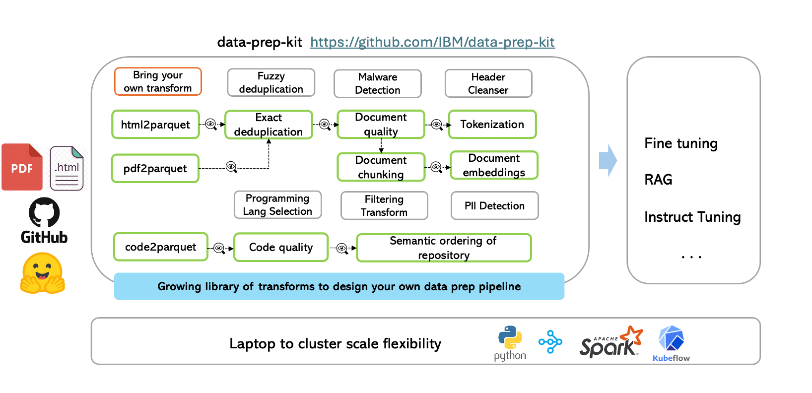

<h1 align="center">Data Prep Kit for Advanced Users</h1>



Below we discuss the following: 
* [Adding your own transform to the repository](ADVANCED.md#adding)
* [Running transforms using the CLI](#cli)
* [Scaling transform execution](#scaling)
* [Using HuggingFace data](#huggingface)

<a name ="adding"></a>
## Add your own transform

At the core of the framework, is a data processing library, that provides a systematic way to implement the data processing modules. The library is python-based and enables the application of "transforms" to a one or more input data files to produce one or more output data files. We use the popular [parquet](https://arrow.apache.org/docs/python/parquet.html) format to store the data (code or language). 
Every parquet file follows a set [schema](transforms/code/code2parquet/python/README.md). A user can use one or more transforms (or modules) 
as discussed in the main [readme](README.md#examples).

A transform can follow one of the two patterns: annotator or filter.

- **Annotator** An annotator transform adds information during the processing by adding one more columns to the parquet files.
The annotator design also allows a user to verify the results of the processing before the actual filtering of the data.

- **Filter** A filter transform processes the data and outputs the transformed data, e.g., exact deduplication.
A general purpose [SQL-based filter transform](transforms/universal/filter) enables a powerful mechanism for identifying columns and rows of interest for downstream processing.

For a new module to be added, a user can pick the right design based on the 
processing to be applied. More details [here](transforms).

One can leverage Python-based processing logic and the Data Processing Library 
to easily build and contribute new transforms.
We have provided an [example transform](transforms/universal/noop) that 
can serve as a template to add new simple transforms. 
Follow the step-by-step [tutorial](doc/quick-start/contribute-your-own-transform.md)
to help you add your own new transform. 

For a deeper understanding of the library's architecture, its transforms, and available runtimes, we encourage the reader to consult the comprehensive [overview document](data-processing-lib/doc/overview.md) alongside dedicated sections on [transforms](data-processing-lib/doc/transforms.md) and [runtimes](data-processing-lib/doc/transform-runtimes.md).

Additionally, check out our [video tutorial](https://www.youtube.com/watch?v=0WUMG6HIgMg) for a visual, example-driven guide on adding custom modules.

<a name = "cli"></a>
## Running Transforms at the Command Line 

You can run transforms via the command line or from within a docker image.
* This [document](doc/quick-start/run-transform-cli.md) shows how to
  run a transform using the command line interface and a virtual environment.
* You can follow this [document](doc/quick-start/run-transform-image.md) to run transforms inside the docker image. 


<a name = "scaling"></a>
## Scaling from laptop to cluster <a name = "laptop_cluster"></a>💻 -> 🖥️☁️ 
Data-prep-kit provides the flexibility to transition your projects from 
proof-of-concept (PoC) stage to full-scale production mode, 
offering all the necessary tools to run your data transformations at high volume. 
In this section, we enable you how to run your transforms at scale and how to automate them. 

#### Scaling of Transforms

To enable processing of large data volumes leveraging multi-mode clusters, [Ray](https://docs.ray.io/en/latest/index.html) 
or [Spark](https://spark.apache.org) wrappers are provided, to readily scale out the Python implementations.

A generalized workflow is shown [here](doc/data-processing.md).

#### KFP Automation

The toolkit also supports transform execution automation based on 
[Kubeflow pipelines](https://www.kubeflow.org/docs/components/pipelines/v1/introduction/) (KFP),
tested on a locally deployed [Kind cluster](https://kind.sigs.k8s.io/) and external OpenShift clusters. There is an 
automation to create a Kind cluster and deploy all required components on it.
The KFP implementation is based on the [KubeRay Operator](https://docs.ray.io/en/master/cluster/kubernetes/getting-started.html)
for creating and managing the Ray cluster and [KubeRay API server](https://github.com/ray-project/kuberay/tree/master/apiserver)
to interact with the KubeRay operator. An additional [framework](kfp/kfp_support_lib) along with several
[kfp components](kfp/kfp_ray_components) is used to simplify the pipeline implementation.

A simple transform pipeline [tutorial](kfp/doc/simple_transform_pipeline.md) explains the pipeline creation and execution. 
In addition, if you want to combine several transformers in a single pipeline, you can look at [multi-steps pipeline](kfp/doc/multi_transform_pipeline.md) 

When you finish working with the cluster, and want to clean up or destroy it. See the 
[clean up the cluster](kfp/doc/setup.md#cleanup)

<a name = "huggingface"></a>
## Using HuggingFace Data 

If you wish to download and use parquet data files from HuggingFace 
while testing any of the toolkit transforms, use HuggingFace 
[download APIs](https://huggingface.co/docs/huggingface_hub/en/guides/download) 
that provide caching and optimize the download process.
Here is an example of the code needed to download a sample file,
first install huggingface_hub

 ```bash
 pip install --upgrade huggingface_hub
```
Then use the following to download a specific file, 
```python
from huggingface_hub import hf_hub_download
import pandas as pd

REPO_ID = "HuggingFaceFW/fineweb"
FILENAME = "data/CC-MAIN-2013-20/000_00000.parquet"

hf_hub_download(repo_id=REPO_ID, filename=FILENAME, repo_type="dataset")
```


