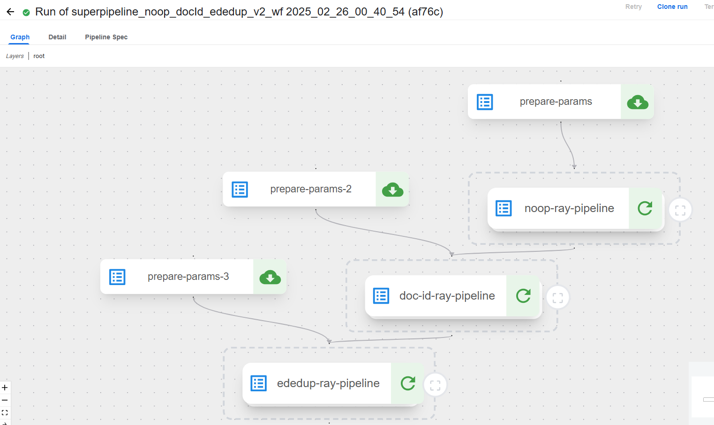
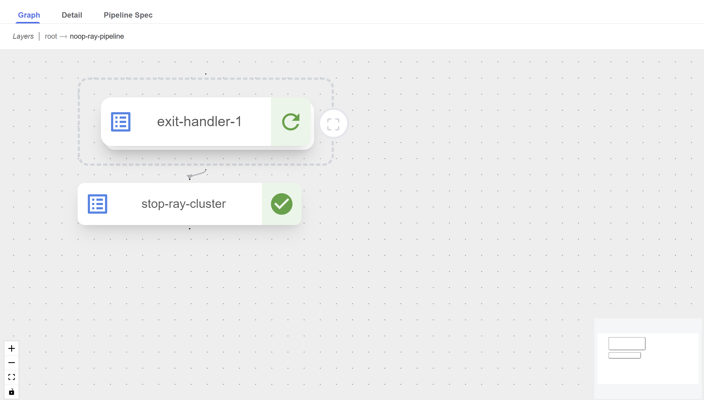
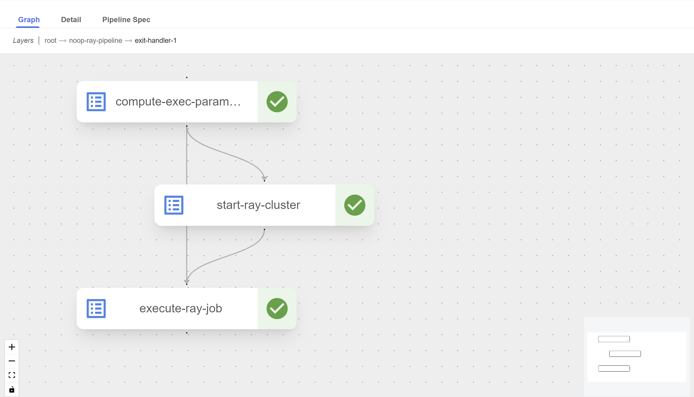
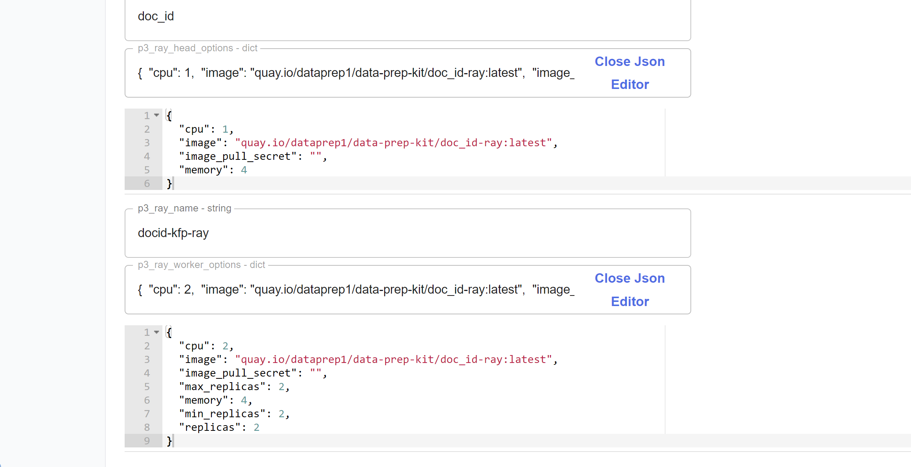

# Chaining transforms using KFP V2

As in [super pipelines of KFP v1](../../../../../kfp/doc/multi_transform_pipeline.md), we want to offer an option of running a series of transforms one after the other on the data. But, in KFP v2 we can make it easier to chain transforms using the [nested pipelines](https://www.kubeflow.org/docs/components/pipelines/user-guides/components/compose-components-into-pipelines/#pipelines-as-components) that KFP v2 offers.

One example of chaining `noop`, `document id` and `ededup` transforms can be found [here](superpipeline_noop_docId_ededup_v2_wf.py). When running this pipeline it appears as hierarchical graph with three nested pipelines, one for each transform as shown in the following screenshots.

`root` Layer


`root -> noop-ray-pipeline` Layer


`root -> noop-ray-pipeline -> exit-handler-1` Layer


Another useful feature of the KFP v2 is the `Json` editor for the `dict` type input parameter as shown here:


## Main differences from KFP v1 superpipeline:
- Uploading the transform pipelines before running the superpipeline is not required. When compiling the superpipeline code, it automatically retrieves the latest versions of the transforms.
  To enable this, the path to the transform pipelines code must be included in `PYTHONPATH` before compiling the superpipeline. In this example, the Makefile ensures `PYTHONPATH` is updated to include the transforms directory. Additionally, if the pipeline references modules in subdirectories 
  (such as in the ededup case, where it refers to a module in the `src` subdirectory) these subdirectories must also be added to `PYTHONPATH`.
- It creates just one run that includes all the nested transfroms and their sub-tasks.
- No need for additional component as `executeSubWorkflowComponent.yaml`. All the implementation in the same pipeline file.
- In superpipelines of KFP v1 there exists an option to override the common parameters with specific values for each one of the transforms. This option is missing in the KFP v2 superpipelines.
- In kfp V2 pipelines the user is requested to insert a unique string for the ray cluster created at run creation time (called `ray_run_id_KFPv2`). This is because in KFPv2 `dsl.RUN_ID_PLACEHOLDER` is deprecated and cannot be used since SDK 2.5.0 and we cannot generate a unique string at run-time, see https://github.com/kubeflow/pipelines/issues/10187.

### How to compile the superpipeline
```
cd examples/kfp/superworkflows/ray/kfp_v2/
make clean
export KFPv2=1
make workflow-build
```

Please be aware that in KFP v2, there is an (issue)[default pipeline input params are missing from the GUI](https://github.com/kubeflow/pipelines/issues/11515]] where default values for pipeline input parameters do not appear in the GUI, 
making them required even if defaults are set. For fields with empty string values, inserting an single space can serve as a workaround. 
This issue has been resolved in newer KFP versions.
