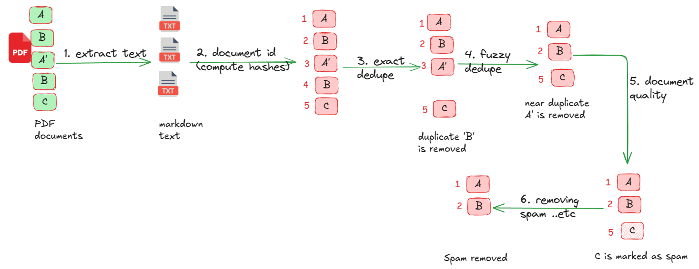

# PDF Processing with Data Prep Kit

Show cases Data Prep Kit capabilities of processing PDFs.

We will demonstrate the following:

- Extracting text from PDF files
- removing duplicates (exact and fuzzy matches)
- accessing document quality and removing documents containing spam words, placeholder content like 'lorem ipsum' ..etc.

**Workflow**



## Setting up Python Environment

The code can be run on either 

1.  Google colab: very easy to run; no local setup needed.
2.  On your local Python environment.  Here is a quick guide.  You can  find instructions for latest version [here](../../../README.md#-getting-started)

```bash
conda create -n data-prep-kit -y python=3.11
conda activate data-prep-kit

# install the following in 'data-prep-kit' environment
cd examples/notebooks/pdf-processing-1
pip3 install  -r requirements.txt

# start jupyter and run the notebooks with this jupyter
jupyter lab
```

## Running the code


[python version](pdf_processing_1_python.ipynb)  &nbsp;    [](https://colab.research.google.com/github/sujee/data-prep-kit/blob/process-pdf-1/examples/notebooks/pdf-processing-1/pdf_processing_1_python.ipynb)

[ray version](pdf_processing_1_ray.ipynb)  &nbsp;   [](https://colab.research.google.com/github/sujee/data-prep-kit/blob/process-pdf-1/examples/notebooks/pdf-processing-1/pdf_processing_1_ray.ipynb)

## Troubleshooting

If you encounter any errors loading libraries, try creating a custom kernel and using it to run the notebooks.

```bash
python -m ipykernel install --user --name=data-prep-kit --display-name "dataprepkit"
# and select this kernel within jupyter notebook
```


## Creating Input PDFs (Optional)

Sample PDFs we use for this example are created from markdown documents using pandoc utility, as follows.

```bash
cd input

pandoc earth.md  -o earth.pdf
pandoc earth2.md  -o earth2.pdf
pandoc mars.md  -o mars.pdf
pandoc spam.md  -o spam.pdf
pandoc lorem-ipsum.md  -o lorem-ipsum.pdf
```

